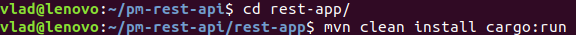

# "Project management" rest-api 
[](https://travis-ci.org/github/vladkondratuk/pm-rest-api)

Java resp-api project to study technologies such as REST, Spring Framework(MVC), Hibernate ORM, Junit5, Mockito, MockMvc, CI/CD and others.

### Project Idea 
Rest-api for "Project management tool" demo project. A simple project to do in one month and gain experience for larger projects. 
I have idea to made my own "Project management tool" to learn new technologies and track time I spent on solving "tasks".

### Project Documentation
 
Steps to make this project:

- [Creating SQL commands for generating MySQL Schema](documentation/sql_schema.md) 
- [Set up Spring MVC using Java-based Configuration](documentation/mvc_config.md)
- [Set up Data Source](documentation/data_source.md)
- [Set up Hibernate using Java-based Configuration](documentation/hibernate_config.md)
- [Defining Entity with JPA and Hibernate](documentation/jpa_entity.md)
- [Creating DAO layer with Hibernate implementation](documentation/dao_layer.md)
- [Creating Service layer](documentation/service_layer.md)
- [Creating Spring MVC REST Controller layer](documentation/controller_layer.md)

Additions:
- [Spring IoC and DI](documentation/spring_ioc_di.md)
- [Spring MVC](documentation/spring_mvc.md)
- [Spring MVC Controllers](documentation/spring_controllers.md)

### Used technologies

 - jdk: 11-amazon-corretto java version
 - build tool: Maven
 - framework: Spring Framework
 - database: MySQL
 - ORM: Hibernate ORM
 - unit test: Junit5
 - mocks: Mockito, MockMvc
 - server: Tomcat embedded
 
### Prerequisites
 
         install git
         install JDK 11(amazon correto, openJDK)
         install maven3+
         install mysql workbench    
         
### Installing
Choose a directory for project, download project from github:
 
       $ git clone https://github.com/vladkondratuk/pm-rest-api.git
       
##### Terminal expected output       


#### Build project
Run terminal command in project directory:

        $ cd pm-rest-api/
        $ mvn clean install
        
##### Terminal input 


##### Terminal expected output


#### Start app
Run terminal command in project directory:

        $ cd /rest-app
        $ mvn clean install cargo:run

##### Terminal input 


##### Terminal expected output


Press Ctrl+C to stop app. 

### How to use REST API

A REST API is an application program interface that uses HTTP requests to GET, PUT, POST and DELETE data.

  #### HTTP Verbs
  
   The HTTP verbs comprise a major portion of our “uniform interface” constraint and provide us the
    action counterpart to the noun-based resource. The primary or most-commonly-used HTTP verbs (or
    methods, as they are properly called) are POST, GET, PUT, and DELETE. These correspond to create,
    read, update, and delete (or CRUD) operations, respectively.
    
  #### GET
  The HTTP GET method is used to retrieve (or read) a representation of a resource.
  
  Examples:
  
    GET http://localhost:8090/rest-api/projects
    GET http://localhost:8090/rest-api/tasks/3
    GET http://localhost:8090/rest-api/activities
    GET http://localhost:8090/rest-api/activities/2
  
  #### PUT
  PUT is most-often utilized for update capabilities, PUT-ing to a known resource URI with the request
  request body containing the newly-updated representation of the original resource.
  
  Examples:
  
    PUT http://localhost:8090/rest-api/projects/1
    PUT http://localhost:8090/rest-api/tasks/3
    
  #### POST
  The POST verb is most-often utilized for creation of new resources. In particular, it's used to create
  subordinate resources. That is, subordinate to some other (e.g. parent) resource. In other words, when
  creating a new resource, POST to the parent and the service takes care of associating the new resource
  with the parent, assigning an ID (new resource URI), etc.
  
  Examples:
  
    POST http://localhost:8090/rest-api/projects
    POST http://localhost:8090/rest-api/tasks
  
  #### DELETE
  DELETE is pretty easy to understand. It is used to delete a resource identified by a URI.
  
  Examples:
  
    DELETE http://localhost:8090/rest-api/projects/1
    DELETE http://localhost:8090/rest-api/tasks/3
  

#### Use curl on new terminal window for HTTP request's 

  Install jq, is a command-line tool for parsing JSON. 

    $ curl GET -v http://localhost:8090/rest-api/projects | jq

##### Terminal expected output 

  
#### Use Postman for HTTP request's


### How it's work
Simple example data conversion from MySQL table to POJO and then to JSON.

##### MySQL Table
```sql
    CREATE TABLE `activity` (
      `id` int(11) NOT NULL AUTO_INCREMENT,
      `activity_name` varchar(128) DEFAULT NULL,
      PRIMARY KEY (`id`)
    )
```

##### Java class(JPA mapping)
```java
@Entity
@Table(name = "activity")
public class Activity {

    @Id
    @GeneratedValue(strategy = GenerationType.IDENTITY)
    @Column(name = "id")
    private Long id;

    @Column(name = "activity_name")
    private String activityName;

    //Constructors
    //Getters and Setters    
}
``` 
##### JSON object(jackson plugin mapping)
```json
{
   "id": 1,
   "activityName": "activity example"
}
```
  
>Produced by Vladiskav Kondratuk 2020