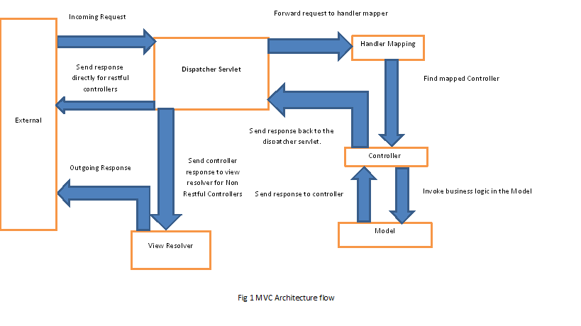

# Spring MVC Controllers

### Overview

 The concept of the ```Front Controller``` in the typical ```Spring Model View Controller``` architecture.

At a very high level, here are the main responsibilities we're looking at:

   - Intercepts incoming requests
   - Converts the payload of the request to the internal structure of the data
   - Sends the data to Model for further processing
   - Gets processed data from the Model and advances that data to the View for rendering

Here's a quick diagram for the high level flow in Spring MVC:

 
 
 As you can see, the ```DispatcherServlet``` plays the role of the ```Front Controller``` in the architecture.
 
 The diagram is applicable both to typical ```MVC``` controllers as well as ```RESTful``` controllers –
  with some small differences (described below).
 
 In the traditional approach, MVC applications are not service-oriented hence there is a
  ```View Resolver``` that renders final views based on data received from a Controller.
 
 ```RESTful``` applications are designed to be service-oriented and return raw data (```JSON/XML``` typically). 
 Since these applications do not do any view rendering, there are no View Resolvers – the Controller 
 is generally expected to send data directly via the ```HTTP``` response.
 
 ### ViewResolver
 
 All MVC frameworks provide a way of working with views.
 
 Spring does that via the view resolvers, which enable you to render models in the 
 browser without tying the implementation to a specific view technology.
 
 The ViewResolver maps view names to actual views.
 
 And the Spring framework comes with quite a few view resolvers e.g. 
 ```InternalResourceViewResolver```, ```XmlViewResolver```, ```ResourceBundleViewResolver``` and a few others.
 
 ### Spring Controller – Spring MVC Controller
 
Spring ```@Controller``` annotation is a specialization of ```@Component``` annotation. Spring Controller annotation 
is typically used in combination with annotated handler methods based on the ```@RequestMapping``` annotation.

#### Spring @Controller

Spring Controller annotation can be applied on classes only. It’s used to mark a class as a web 
request handler. It’s mostly used with Spring MVC application.

##### @Controller example

```java
@Controller
@RequestMapping("/say-hello")
public class HelloWorldController {

    @GetMapping
        public String showHelloForm(@RequestParam("studentName") String theName, Model model) {
    
            String result = "Welcome, " + theName.toUpperCase() + "!";
            model.addAttribute("message", result);
    
            return "hello-world";
        }
    //...
}
```

First, we created a controller called ```HelloWorldController``` and mapped it to the ```“/say-hello” path```. 
In the class we have created a method which returns a ```View ”hello-world” ```object and is mapped to a GET 
request thus any URL call ending with ```“/say-hello”``` would be routed by the ```DispatcherServlet``` to the 
```showHelloForm()``` method in the ```HelloWorldController```.

And of course we're returning the ```View ”hello-world”``` object with some model data for good measure.

The view object has a name set to ```“hello-world“```. The View Resolver will search 
for a page in the WEB-INF folder called ```“hello-world.jsp“```.

#### Spring @RestController

Spring ```@RestController``` is a convenience annotation that is itself annotated with ```@Controller``` and 
```@ResponseBody```. This annotation is used to mark a class as request handler for ```RESTful``` web services.

The setup for a ```Spring RESTful``` application is the same as the one for the ```MVC``` 
application with the only difference being that there is no ```View Resolvers``` and no model map.

The API will generally simply return raw data back to the client – ```XML``` and ```JSON```representations usually – 
and so the ```DispatcherServlet``` bypasses the view resolvers and returns the data right in the ```HTTP``` response body.

##### @RestController example

```java
@RestController
@RequestMapping("/rest-api")
public class TaskRestController {

    private final TaskService taskService;

    public TaskRestController(TaskService taskService) {
        this.taskService = taskService;
    }

    @GetMapping("/tasks")
    public List<Task> getTasks() {
        return taskService.getTasks();
    }
    //...
}
```

The ```@RestController``` annotation from Spring Boot is basically a quick shortcut that saves us from 
always having to define ```@ResponseBody```.

```@ResponseBo```dy annotation on the method – instructs Spring to bypass 
the view resolver and essentially write out the output directly to the body of the ```HTTP``` response.

[Back to README](../README.md)