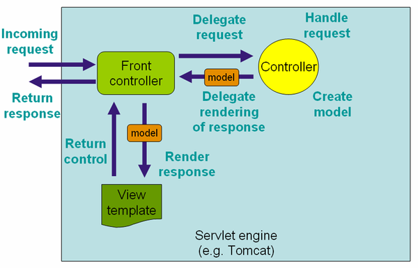

# Spring MVC

A Spring MVC is a Java framework which is used to build web applications. It follows the 
Model-View-Controller design pattern. It implements all the basic features of a core Spring 
framework like Inversion of Control, Dependency Injection.

###### Check [Spring IoC and DI](spring_ioc_di.md) for more about Inversion of Control and Dependency Injection. 

A Spring MVC provides an elegant solution to use MVC in spring framework by the help of 
DispatcherServlet. Here, DispatcherServlet is a class that receives the incoming request 
and maps it to the right resource such as controllers, models, and views.

###### Check [Set up Spring MVC using Java-based Configuration](mvc_config.md) for more about Spring MVC configuration.

### Model-View-Controller (MVC)

The Model-View-Controller (MVC) is an architectural pattern that separates an application into 
three main logical components: the model, the view, and the controller. Each of these components
 are built to handle specific development aspects of an application. MVC is one of the most 
 frequently used industry-standard web development framework to create scalable and extensible projects.
 
 ##### MVC Components
 
 
 
#### Model

The Model component corresponds to all the data-related logic that the user works with. This 
can represent either the data that is being transferred between the View and Controller components 
or any other business logic-related data. For example, a Customer object will retrieve the customer 
information from the database, manipulate it and update it data back to the database or use it to render data.

#### View

The View component is used for all the UI logic of the application. For example, the Customer 
view will include all the UI components such as text boxes, dropdowns, etc. that the final user interacts with.

#### Controller

Controllers act as an interface between Model and View components to process all the 
business logic and incoming requests, manipulate data using the Model component and interact with the 
Views to render the final output. For example, the Customer controller will handle all the interactions 
and inputs from the Customer View and update the database using the Customer Model. The same controller 
will be used to view the Customer data.

#### Spring Model-View-Controller

   
   

  - **Model** - A model contains the data of the application. A data can be a single object or a collection of objects.
  
  - **Controller** - A controller contains the business logic of an application. The @Controller annotation 
  is used to mark the class as the controller.
  
  - **View** - A view represents the provided information in a particular format. Generally, JSP+JSTL is used 
  to create a view page. Although spring also supports other view technologies such as Apache Velocity, 
  Thymeleaf and FreeMarker.
  
  - **Front Controller** - In Spring Web MVC, the DispatcherServlet class works as the front controller. 
  It is responsible to manage the flow of the Spring MVC application.
  
##### Advantages of Spring MVC Framework:

   - **Separate roles** - The Spring MVC separates each role, where the model object, controller, 
    command object, view resolver, DispatcherServlet, validator, etc. can be fulfilled by a specialized object.
    
   - **Light-weight** - It uses light-weight servlet container to develop and deploy your application.
   
   - **Powerful Configuration** - It provides a robust configuration for both framework and application classes that includes easy referencing across contexts, such as from web controllers to business objects and validators.
    Rapid development - The Spring MVC facilitates fast and parallel development.
    
   - **Reusable business code** - Instead of creating new objects, it allows us to use the existing business objects.
   
   - **Easy to test** - In Spring, generally we create JavaBeans classes that enable you to inject test data using the 
    setter methods.
    
   - **Flexible Mapping** - It provides the specific annotations that easily redirect the page.

[Back to README](../README.md)